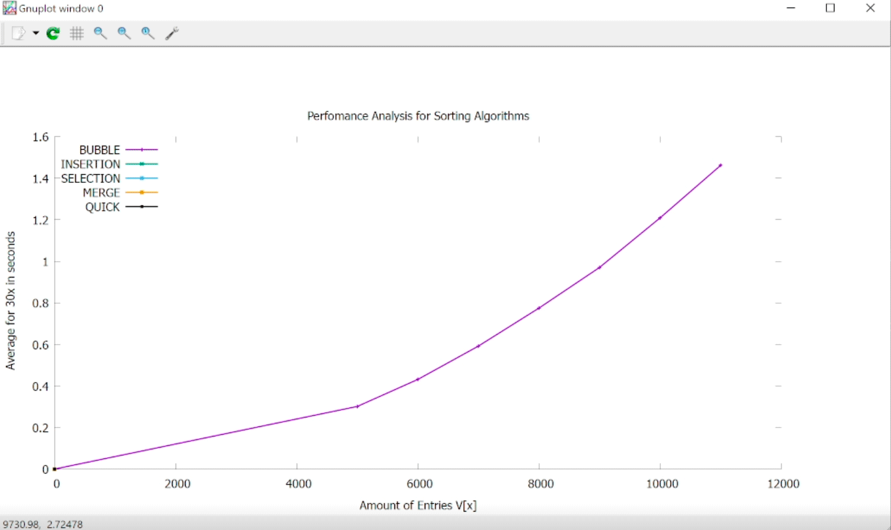
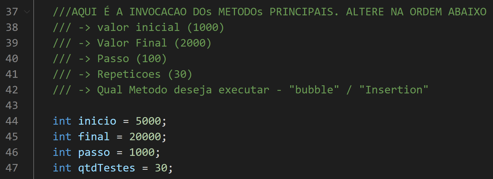
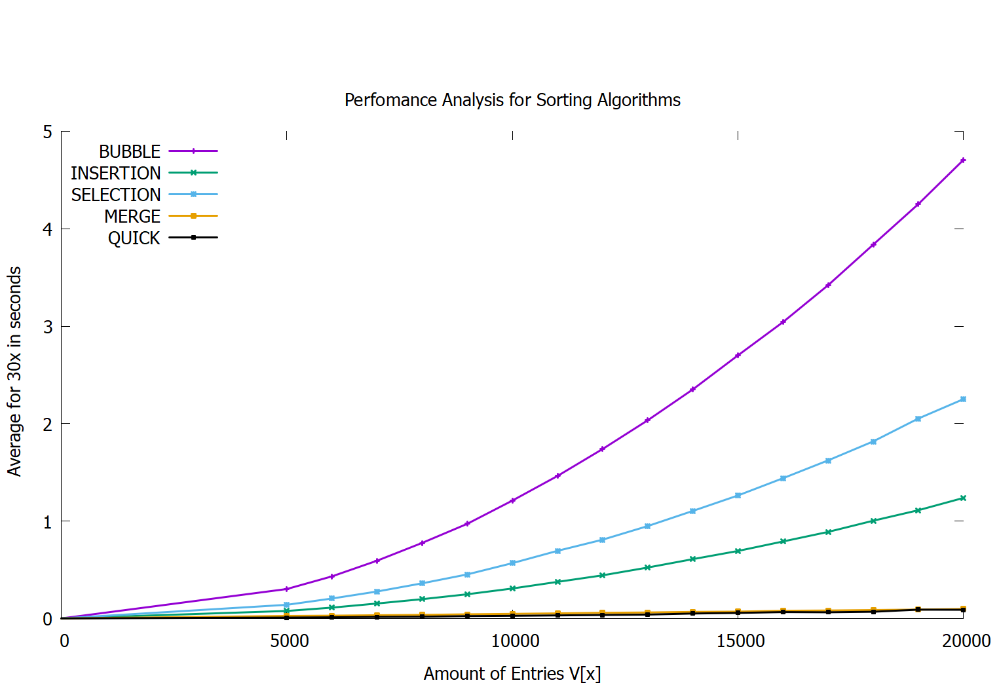

**AVALIAÇAO DE PERFORMANCE DE ALGORÍTMOS DE ORDENAÇÃO​ - C++** :computer: 

Mestrado em Modelagem Computacional - UFF/ EEIMVR - 20/04/2024

Objetivo deste projeto é executar e cronometrar algoritmos para ordenação de vetores nas linguagens C/C++, obter os tempos de ordenação para as amostragem e comparar as complexidades de cada algoritmo. :timer_clock:

**Motivação do Estudo**: 
--> Muitos problemas computacionais do mundo atual consistem em avaliar, ordenar e/ou classificar grandes massas de informações.
 Problemas como pré-processar, segmentar, classificar, comuns do segmento de **Visão Computacional**, são exemplos de aplicações que necessitam essencialmente de algoritmos poderosos e que consigam produzir respostas em espaço de tempo relativamente pequenos. Naturalmente, para problemas de **Visão Computacional** utiliza-se matrizes M[m][n].
 Neste estudo, trataremos de objetos de dimensão menor, os Vetores V[x], mas cujo o propósito é similar ao de matrizes: guardar informações.

 Análise Teórica de complexidade O(n), juntamente com a análise de tempos de execução de algoritmos.

 **palavras-chave**:
 EFICIÊNCIA / COMPLEXIDADE / PERFORMANCE / C / C++

*Figura 1 - Figura animada mostrando em tempo real a obtenção dos resultados para cada método*

**Parâmetros**:

---> Vetores com V[5000] ~ V[20000];

---> Cada vetor é criado com entradas aleatórias, utilizando como apoio a biblioteca <random> padrão da biblioteca C/C++.

---> x30 vezes a execução de cada ordenação para obter medias de tempo

---> Os tempos são obtidos com o apoio da Biblioteca <Chrono> , sendo iniciado uma marcação de tempo antes do processo de ordenação, após o processo e então calculada a diferença entre os tempos para obter o tempo final de execução do processo.

---> Execução de algoritmos de ordenação: 
• Bubble Sort
• Insertion Sort
• Selection Sort
• Merge Sort
• Quick Sort

---> Cada método de ordenação é validado pelo programa adicional de testes **TesteUnitarioDosMetodos.cpp** criado para este fim.

Instruções para futuros usuários do software:

---> Utilizado software gratuito para plotar gráficos [GNUPLOT](http://www.gnuplot.info/)

---> Os gráficos são gerados e atualizados em tempo real de forma automática pelo programa, através de um Pipe criado para utilizar os recursos disponibilizados pelo [GNUPLOT](http://www.gnuplot.info/).

---> É necessário possuir o [GNUPLOT](http://www.gnuplot.info/) instalado e adicionado como "variável de ambiente" para permitir acesso aos recursos do software via Pipe dentro do programa principal.

---> Os resultados das médias para cada método em cada configuração de teste é armazenado e identificado pelos arquivos no diretório "relatórios-de-testes".

---> Ao finalizar uma bateria de testes, crie uma cópia dos relatórios gerados para garantir que os mesmos não sejam perdidos ao se executar uma nova análise.

---> O programa principal a ser compilado se encontra no arquivo **CronometroPerformance.cpp**

---> Os parâmetros iniciais como devem ser configurados diretamente no código fonte principal **CronometroPerformance.cpp** através das seguintes variáveis declaradas:

*Figura 2 - Figura ilustrativa para configuração dos parâmetros de avaliação das baterias de testes.*

---> Os testes foram rodados em um computador com processador de 4GHz e 32GB de memória.

**RESULTADOS **

A seguir os resultados do experimento:

Médias de tempo obtidas ao executar x30 a operação de ordenação para tamanhos de vetores:

<table style='width: 900px; text-align: center'>
    <tr><th>Vetor V[X]</th>  <th>Bubble (s)</th> <th>Insertion (s)</th><th>Selection (s)</th><th>Merge (s)</th><th>Quick (s)</th></tr>
    <tr><td>5000</td>   <td>0.301503</td>   <td>0.076705</td>   <td>0.139803</td>   <td>0.0254888</td>   <td>0.00855007</td></tr>
    <tr><td>6000</td>   <td>0.431632</td>   <td>0.1109</td>   <td>0.204562</td>   <td>0.0284656</td>   <td>0.0114516</td></tr>
    <tr><td>7000</td>   <td>0.59201</td>    <td>0.153208</td>   <td>0.276488</td>   <td>0.0328481</td>   <td>0.0151287</td></tr>
    <tr><td>8000</td>   <td>0.77493</td>    <td>0.19752</td>   <td>0.360183</td>   <td>0.0360075</td>   <td>0.0176446</td></tr>
    <tr><td>9000</td>   <td>0.970366</td>   <td>0.247786</td>   <td>0.451369</td>   <td>0.0422448</td>   <td>0.0234544</td></tr>
    <tr><td>10000</td>  <td>1.20921</td>    <td>0.307304</td>   <td>0.567066</td>   <td>0.0472601</td>   <td>0.0266327</td></tr>
    <tr><td>11000</td>  <td>1.46172</td>    <td>0.37517</td>   <td>0.693931</td>   <td>0.0516884</td>   <td>0.0306901</td></tr>
    <tr><td>12000</td>  <td>1.73793</td>    <td>0.441935</td>   <td>0.8079</td>   <td>0.0577216</td>   <td>0.0356233</td></tr>
    <tr><td>13000</td>  <td>2.03334</td>    <td>0.52244</td>   <td>0.947553</td>   <td>0.0611123</td>   <td>0.0398861</td></tr>
    <tr><td>14000</td>  <td>2.3498</td>     <td>0.608143</td>   <td>1.10294</td>   <td>0.0670111</td>   <td>0.0502336</td></tr>
    <tr><td>15000</td>  <td>2.6992</td>     <td>0.691989</td>   <td>1.26146</td>   <td>0.0695877</td>   <td>0.0562454</td></tr>
    <tr><td>16000</td>  <td>3.04141</td>    <td>0.789506</td>   <td>1.4391</td>   <td>0.0783118</td>   <td>0.0650946</td></tr>
    <tr><td>17000</td>  <td>3.41981</td>    <td>0.887748</td>   <td>1.62199</td>   <td>0.0811971</td>   <td>0.0631295</td></tr>
    <tr><td>18000</td>  <td>3.83621</td>    <td>1.00276</td>   <td>1.81682</td>   <td>0.0863501</td>   <td>0.0687258</td></tr>
    <tr><td>19000</td>  <td>4.25198</td>    <td>1.11069</td>   <td>2.05156</td>   <td>0.090426</td>   <td>0.0899011</td></tr>
    <tr><td>20000</td>  <td>4.7058</td>     <td>1.23645</td>   <td>2.25016</td>   <td>0.0968273</td>   <td>0.0889181</td></tr>
</table>

A seguir gráfico interpolado dos resultados:

*Figura 3 - Gráfico comparativo dos resultados obtidos, médias dos tempos de execução dos algoritmos de ordenação para vetores com tamanhos progressivos.*

**Comentários:**

Dos 5 métodos avaliados, o **Bubble Sort** demonstrou significativo aumento de tempo necessário, caracterizando uma curva do tipo O(n²), o que concorda com sua análise de complexidade.

Tanto **Insertion sort** quanto **Selection sort** apresentaram resultados significativamente melhores se comparados ao **Bubble Sort** apesar de também possuírem complexidade de tempo **O(n²)**, sendo **Insertion sort** o algoritmo com melhor desempenho (aproximadamente x4 menor do que o **Bubble sort!**) dos 3.

Tanto o **Merge** quanto o **Quick Sort** apresentaram resultados extremamente satisfatórios para os tempos estimados (aproximadamente x50 vezes menores do que o pior resultado - **Bubble Sort**) e isso se explica pela análise de complexidade, que para o **Merge Sort**, que utiliza de técnicas recursivas de divisão do vetor para realizar a ordenação, equivale a uma curva do tipo **O(n Log n)**. Já o **Quick Sort** apesar de em maioria apresentar comportamento similar ao do **Merge Sort**, ou seja **O(n log n)** para casos mais favoráveis, é dependente assim da escolha do **elemento pivot** podendo no seu pior caso, apresentar comportamento do tipo **O(n²)**.

Uma observação importante é que ambos os métodos (**Merge e Quick**) fazem uso de **consumos elevados de memória** para realizar operações eficientes, e isso acontece **devido a natureza de seus algoritmos recursivos**, podendo neste caso não serem adequados à sistemas que possuem escassez deste tipo de recurso.

**CONCLUSÃO**

O resultado deste experimento permite concluir que se o que é desejado no processo de ordenação é rapidez, independente do consumo de mais recurso de memória disponível, **Merge** e **Quick** **Sort** são opções interessantes, visto que apresentam resultados melhores de tempo, sendo o **Quick Sort** uma opção menos instável, a depender da escolha do pivot e também do nível de desordem do Vetor.  Todavia, caso memória e outros recursos sejam limitantes no processo, o **Insert Sort** pode ser mostrar uma alternativa mais interessante, pois apesar de apresentar uma curva de consumo de tempo do tipo **O(n²)**, ainda sim entrega resultados de tempos bem menores do que as outras opções, não tendo seu algoritmo focando em recursividade, mas em iteração , o que nos leva há um consumo de memoria inferior se comparado aos métodos recursivos.

**MATERIAL DE REFERÊNCIA** 

1 - 2010, ESTRUTURA DE DADOS - Ana Fernanda Gomes Ascencio & Graziela Santos de Araujo
